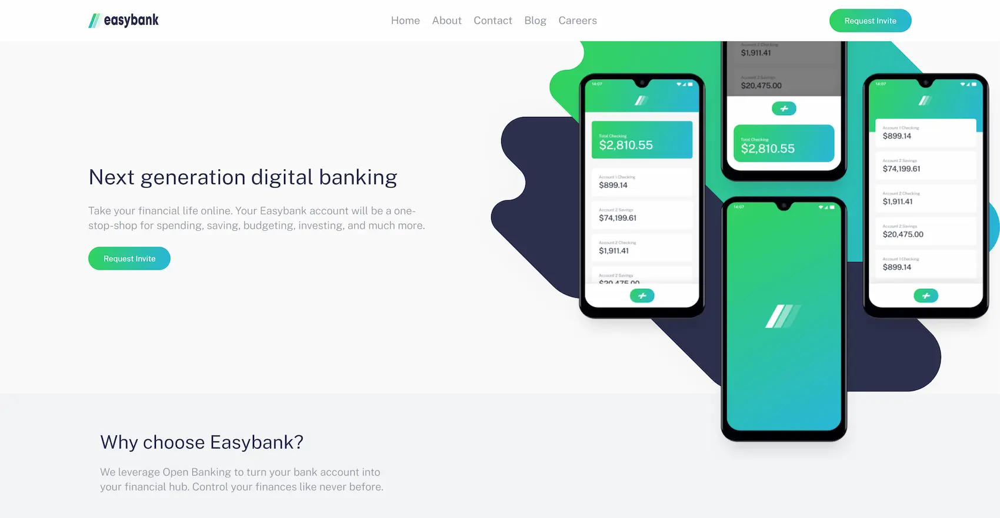
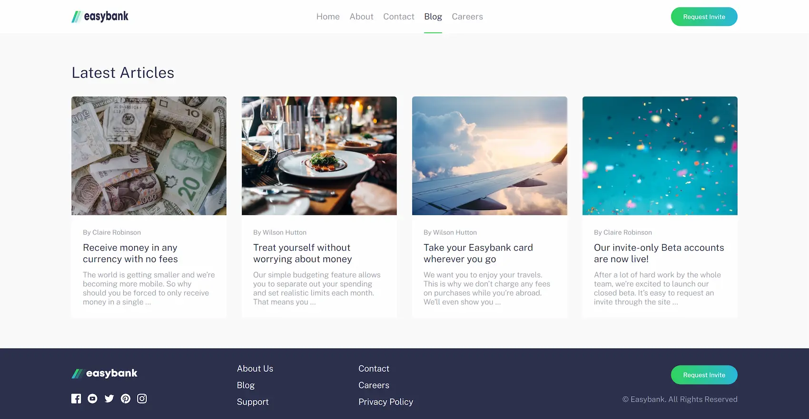
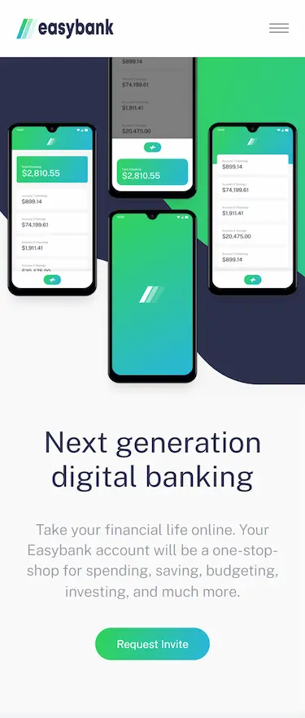

# Frontend Mentor - Easybank landing page solution

This is a solution to the [Easybank landing page challenge on Frontend Mentor](https://www.frontendmentor.io/challenges/easybank-landing-page-WaUhkoDN). Frontend Mentor challenges help you improve your coding skills by building realistic projects.

### The challenge

Users should be able to:

- View the optimal layout for the site depending on their device's screen size
- See hover states for all interactive elements on the page

### Screenshots

### Links

- [Live Site URL](https://crissvp.github.io/easybank-landing-page/)

### Built with

- Flexbox
- CSS Grid
- Mobile-first workflow
- Semantic HTML5 markup
- CSS custom properties
- Astro framework

## Author

- Frontend Mentor - [@CrissVp](https://www.frontendmentor.io/profile/CrissVp)
